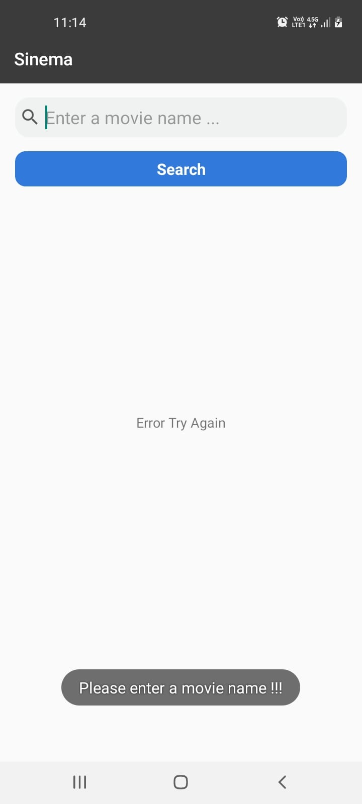
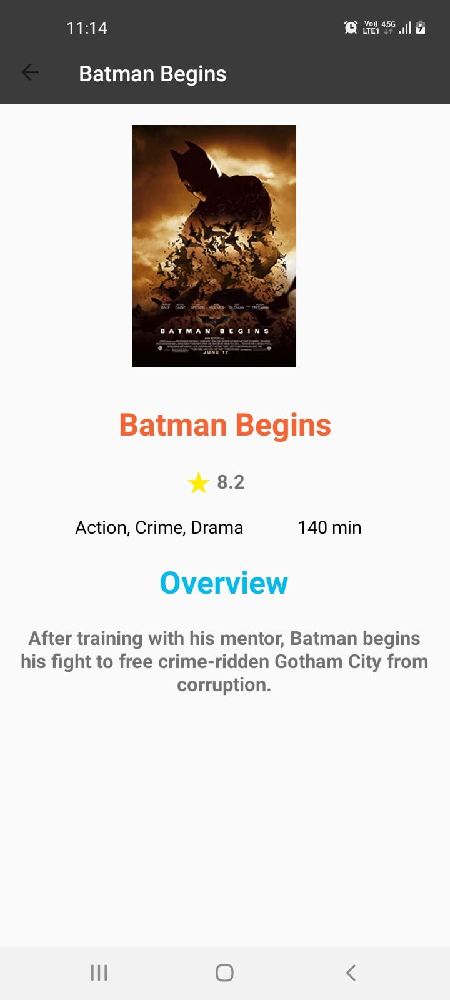

# MoviesApp

## Project Features

- [MVVM](https://developer.android.com/topic/libraries/architecture/viewmodel)
- [Dagger Hilt](https://developer.android.com/training/dependency-injection/hilt-android)
- [Retrofit](https://square.github.io/retrofit/)
- [Navigations](https://developer.android.com/guide/navigation)
- [Glide](https://github.com/bumptech/glide)
- [Coroutines](https://developer.android.com/topic/libraries/architecture/coroutines)
- [DataBinding](https://developer.android.com/topic/libraries/data-binding)

## Screens

<table>
  <tr>
    <th>Movie Error</th>
    <th>Movie Search Result</th>
    <th> Movie Detail</th>
  </tr>
  <tr>
    <td></td>
    <td></td>
    <td></td>
  </tr>
</table>

